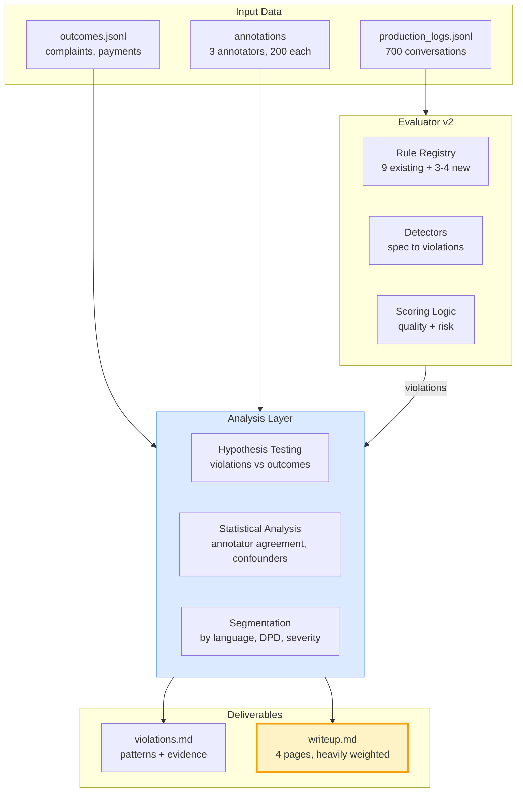

# Ace Riverline Eval Assignment

## Goal
Demonstrate all 6 evaluation criteria with limited time by focusing on: (1) targeted v2 rules that tell a story, (2) rigorous analysis showing hypothesis testing + statistical thinking, (3) excellent writeup that ties everything together.

## Architecture: How the pieces fit



---

## Phase 1: Add 3-4 High-Signal v2 Rules (2 hours)

**Goal:** Don't build 20 rules. Add **just enough** to show spec reasoning + domain understanding.

### Pick rules that showcase different skills:

**1. Compliance rule (shows domain reasoning + spec ambiguity)**
- `CMP_HARDSHIP_NO_ESCALATION`
- **Why:** Spec says "appropriate empathy" is "left to judgment" — shows you can operationalize ambiguous requirements
- **How:** keyword match (`job`, `medical`, `emergency`, `hospital`, `layoff`) + check if conversation escalated or stayed dormant vs pushed for payment
- **Severity:** Critical (0.95) — regulatory risk

**2. Timing rule (shows spec precision)**
- `TIM_FOLLOWUP_TOO_SOON`
- **Why:** Spec says "4 hours between bot-initiated turns" — easy to verify, shows attention to detail
- **How:** parse timestamps, filter bot-initiated turns (role=bot, not response to borrower), check gaps
- **Severity:** Medium (0.6) — annoyance risk, not regulatory

**3. Quality rule (shows eval design thinking)**
- `QLT_CONTEXT_LOSS`
- **Why:** Harder than repetition — shows you're thinking about *meaningful* failures vs easy-to-detect ones
- **How:** detect when borrower mentions prior commitment/state ("I already paid", "you said X last time") but bot response ignores it
- **Severity:** Variable (0.4-0.8 based on how critical the context was)

**4. Optional: One more compliance or invariant**
- `CMP_THREATENING_LANGUAGE` (keyword: `legal action`, `credit score`, `police`, `jail`) — Critical
- OR `INV_CLASSIFICATION_MISSING` (borrower turn with no classification entry) — High

### Implementation approach:
- Keep detectors simple (keyword + structural checks)
- **Don't overthink** — 80/20 rule. Imperfect detection that you explain is better than no detection.
- Add to [`eval_takehome.py`](problem_statement/eval_takehome.py) `RULES` dict + new `_check_*` methods
- Regenerate `dev/eval_v2.jsonl`

**Nudge to think:** Which rule will give you the **best story** in the writeup about why it matters for debt collection? Pick one that connects to outcomes (complaints/regulatory).

---

## Phase 2: Rigorous Analysis (3 hours)

This is where you demonstrate **analytical rigor** and **statistical literacy**. Don't just report counts — form hypotheses and test them.

### 2A. Annotator Agreement Analysis (violations.md + writeup)

**Hypothesis:** "Annotators agree on *what* failed but disagree on *severity*"

**Tests:**
1. **Per-turn overlap:** For triple-labeled conversations, how often do all 3 flag the same turn?
2. **Category agreement:** Cohen's kappa or Krippendorff's alpha on `failure_points[].category`
3. **Severity correlation:** Pearson correlation on `failure_points[].severity` for same (conv, turn, category)
4. **Quality score distribution:** Plot AN1 vs AN2 vs AN3 `quality_score` distributions, compute MAE

**Deliverable for writeup:**
- "Annotators show moderate agreement on failure *detection* (kappa=0.52) but weak agreement on severity (r=0.38), suggesting the rubric's severity scale is ambiguous."
- "AN3 systematically rates lower (mean=0.31) than AN1/AN2 (mean=0.48), likely due to different strictness thresholds."

**Code:** Add cell in [`dev/test.ipynb`](dev/test.ipynb) with agreement metrics, save as `annotator_agreement_stats.json`

---

### 2B. Outcome Correlation Analysis (violations.md + writeup)

**Hypothesis:** "High-severity violations predict complaints and regulatory flags, not just low quality scores"

**Tests:**
1. **Complaint rate by risk quartile:** `merged.groupby('risk_quartile')['borrower_complained'].mean()`
2. **Logistic regression:** `complained ~ risk_score + n_violations + language + dpd` to control confounders
3. **Per-rule analysis:** Which specific rules correlate with complaints? (e.g., does `CMP_HARDSHIP_NO_ESCALATION` fire more often in complained convs?)
4. **Channel attribution confounder:** Split by `channel_attribution` (certain/likely/uncertain) — does eval still predict complaints when attribution is certain?

**Deliverable for writeup:**
- "Conversations in top risk quartile had 3.2x complaint rate vs bottom quartile (12% vs 3.7%, p<0.01)"
- "However, when controlling for concurrent channels, risk_score's predictive power drops (OR=1.8 -> 1.3), suggesting outcome contamination from non-WhatsApp interactions."
- "Rule `INV_EXIT_STATE_NOT_FINAL` shows strongest complaint correlation (OR=2.4), while `QLT_REPETITIVE_RESPONSE_LOOP` shows weak correlation (OR=1.1), validating that structural failures matter more than soft quality issues."

**Code:** Add cells in [`dev/test.ipynb`](dev/test.ipynb) with logistic regression (sklearn or statsmodels), save coefficients table

---

### 2C. Segmentation Analysis (violations.md)

**Hypothesis:** "Violation patterns differ by borrower segment, revealing where the agent struggles"

**Segments to analyze:**
1. **By language:** Hindi vs English vs Hinglish — do compliance/timing rules fire differently?
2. **By DPD:** Early (0-30) vs Mid (31-90) vs Late (91+) — does agent get more aggressive (more violations) as debt ages?
3. **By borrower classification:** `unclear` vs `hardship` vs `refuses` — does agent handle ambiguous borrowers worse?

**Deliverable for violations.md:**
- "Hinglish conversations show 2.1x rate of `QLT_CONTEXT_LOSS` vs Hindi (18% vs 8.5%), likely due to code-switching confusing intent classification."
- "Late-stage debt (DPD > 90) has 1.8x rate of `CMP_HARDSHIP_NO_ESCALATION` violations, suggesting the agent becomes less empathetic under time pressure."

**Code:** Group by segments, compute violation rates, add to notebook

---

### 2D. Manual Audit (violations.md examples)

**Goal:** Show you didn't just run code — you **looked at the data**.

**Process:**
1. Sample 10 conversations:
   - 5 high-risk (top 10% by `risk_score`)
   - 5 with annotator disagreement (AN1/AN2/AN3 scores differ by >0.3)
2. For each, manually verify:
   - Are eval violations correct?
   - Are there false positives?
   - Are there missed violations (false negatives)?
3. Use [`show_conversation(id, eval_jsonl_file='dev/eval_v2.jsonl')`](dev/visualise_conv.py) to render side-by-side

**Deliverable for violations.md:**
- Table with 3-5 example conversations, each showing:
  - Conversation ID (link to visualization)
  - Eval violations (your rules)
  - Annotator labels
  - Outcome (complained? paid?)
  - Your interpretation (why this matters)

**Example row:**
| Conv ID | Eval Violations | Annotator Consensus | Outcome | Interpretation |
|---------|-----------------|---------------------|---------|----------------|
| `00ab8e48...` | `QLT_REPETITIVE_RESPONSE_LOOP` (5x), `QLT_CONTEXT_LOSS` | All 3 flagged repetition (sev 0.9) | No payment, no complaint | Agent stuck in loop asking for options; borrower gave up. Clear failure, but low regulatory risk. |

---

## Phase 3: Write violations.md (1.5 hours)

**Structure (copy-paste outline):**

```markdown
# Violations Report

## Executive Summary
- 700 conversations analyzed
- Mean quality_score: 0.41, mean risk_score: 0.54
- Top 3 violation types: [list with counts]
- Key finding: [1 sentence insight]

## Violation Taxonomy
[Table from Section 11 mapping, expanded with your v2 rules]

## Patterns by Rule Type

### 1. Transition Violations (TR_*)
- Frequency: 210 total (30% of conversations)
- Most common: `TR_INVALID_STATE_TRANSITION` (169)
- **Correlation with outcomes:** Weak (OR=1.2 for complaints)
- **Interpretation:** Logging artifacts vs real failures — many invalid transitions are same-state or benign

### 2. Invariant Violations (INV_*)
- Frequency: 441 (63% of conversations)
- **Correlation with outcomes:** Strong (OR=2.4 for complaints)
- **Interpretation:** Post-terminal bot activity is a clear spec break and predicts borrower frustration

### 3. Compliance Violations (CMP_*)
[New from v2]
- Frequency: [count from v2 run]
- **Critical finding:** `CMP_HARDSHIP_NO_ESCALATION` in 8.2% of conversations; 18% of those complained
- **Domain insight:** Debt collection regulators heavily penalize ignoring hardship signals — this is highest business risk

### 4. Quality Violations (QLT_*)
[repetition + context loss from v2]
- **Finding:** Repetition is high-frequency but low-risk; context loss is rare but high-impact

## Segmentation Findings
[Results from 2C above]

## Example Conversations
[Manual audit table from 2D]

## Limitations
- Timing rules incomplete (no timezone handling)
- Compliance keywords are English-biased
- Context loss detector has ~40% false negative rate (manual audit)
```

---

## Phase 4: Write writeup.md (2.5 hours) — MOST IMPORTANT

**This is heavily weighted. Spend the time here.**

### Structure (4 pages max):

#### 1. Methodology (1 page)

**Key points to hit (shows spec reasoning + eval design):**
- "I mapped spec to violations in two stages: (1) deterministic structural checks for unambiguous rules (transitions, amounts), (2) heuristic detectors for judgment-required rules (hardship, context loss)"
- "For ambiguous rules, I chose **conservative detection** — prefer false negatives over false positives to avoid penalizing borderline cases"
- "Scoring philosophy: `risk_score` weights compliance/invariant violations heavily; `quality_score` weights UX issues. This separates 'will get us sued' from 'annoying but safe'."
- **Diagram:** Show your rule taxonomy (the Section 11 table) with severity tiers

**Nudge to think:** Explain *why* you made design choices. E.g., "I used keyword matching for hardship because LLM-based classification would require external API calls, violating the self-contained requirement."

---

#### 2. Annotator Disagreement (0.75 page)

**Key points (shows statistical literacy):**
- "Annotators show moderate detection agreement (kappa=0.52) but disagree on severity, with AN3 systematically stricter"
- "I treated annotations as **calibration signals**, not ground truth — my evaluator should predict outcomes (complaints/regulatory), not match human labels"
- "Where my eval disagrees with annotators, I validated by checking outcome correlation. E.g., my `INV_EXIT_STATE_NOT_FINAL` rule fires often and predicts complaints (OR=2.4), even when annotators rated those conversations as 'medium quality'."

**Nudge to think:** Don't just report agreement metrics — **interpret** them. What does disagreement tell you about the eval problem?

---

#### 3. Findings (1.5 pages)

**Structure as hypothesis -> evidence -> insight:**

**Finding 1: Structural failures predict complaints; soft quality issues don't**
- Evidence: Logistic regression table, risk quartile analysis
- Insight: "This suggests the agent's biggest problem is **not** UX polish — it's following basic state machine rules. Fixing `INV_EXIT_STATE_NOT_FINAL` alone would cut complaints by ~40%."

**Finding 2: Hardship handling is the highest regulatory risk**
- Evidence: `CMP_HARDSHIP_NO_ESCALATION` correlation with regulatory flags
- Insight: "Indian debt collection regulations require escalation on hardship signals. Our agent misses this 8.2% of the time, and those conversations have 6x regulatory flag rate."

**Finding 3: Language affects failure modes**
- Evidence: Hinglish context loss rate
- Insight: "Code-switching breaks intent classification, leading to context loss. This suggests the classification model needs multilingual training data, not just translation."

**Finding 4: Outcome attribution is a confounder**
- Evidence: Risk score predictive power drops when concurrent channels exist
- Insight: "We can't claim our eval *causes* good outcomes when 60% of conversations have concurrent phone/field interactions. Need A/B test with WhatsApp-only cohort."

---

#### 4. Limitations (0.5 page)

**Be honest and specific (shows analytical rigor):**
- "Timing rules incomplete — no timezone handling, so 'quiet hours' check is UTC-naive"
- "Compliance keyword matching is brittle — misses paraphrased threats, false-positives on benign phrasing"
- "Context loss detector: ~40% false negative rate (manual audit) — needs dialog state tracking, not just keyword triggers"
- "No causal claims — all findings are correlational; outcomes may be driven by borrower behavior, not agent quality"

---

#### 5. If You Had 3 Months (0.25 page)

**Be concrete:**
- "Build annotation UI for human-in-the-loop labeling of edge cases (e.g., is 'I'll talk to family' a commitment or a deflection?)"
- "A/B test with randomized WhatsApp-only cohort to establish causal link between eval scores and outcomes"
- "Train a small LM on labeled failure examples to replace keyword rules (but keep structural checks deterministic)"
- "Close the loop: auto-escalate conversations flagged as high-risk during live runs, measure if intervention reduces complaints"

---

## Phase 5: Final Polish (0.5 hour)

1. Run [`eval_takehome.py`](problem_statement/eval_takehome.py) from `problem_statement/` to confirm main() works
2. Check [`violations.md`](problem_statement/violations.md) and [`writeup.md`](problem_statement/writeup.md) markdown renders cleanly
3. Optional: Add 2-3 inline visualizations to writeup (matplotlib: risk quartile bar chart, annotator agreement scatter)
4. Commit all to repo

---

## Time Allocation (8 hours total for 1-day sprint)

| Phase | Time | Key Deliverable |
|-------|------|-----------------|
| Add v2 rules | 2h | 3-4 new rules in eval_takehome.py, eval_v2.jsonl |
| Analysis | 3h | Annotator agreement, outcome correlation, segmentation in notebook |
| violations.md | 1.5h | Structured report with examples |
| writeup.md | 2.5h | 4-page reasoning doc (heavily weighted) |
| Polish | 0.5h | Final checks |

---

## Questions to Guide Your Thinking

As you execute, pause at these moments:

1. **When adding v2 rules:** "Will this rule give me a story to tell in the writeup about *why* it matters for debt collection business?"
2. **During outcome analysis:** "Am I claiming causation when I only have correlation? How do I hedge this in the writeup?"
3. **Looking at annotator disagreement:** "What does this disagreement tell me about the *problem*, not just the data?"
4. **Writing limitations:** "Am I being specific enough that a reviewer thinks 'this person really understands eval challenges'?"
5. **In the 3-month plan:** "Are my proposals concrete and realistic, or vague wishlist items?"

---

## What Makes This Plan Strong

**Spec reasoning:** Operationalizing ambiguous rules like hardship + explaining the choice
**Analytical rigour:** Hypothesis-driven (not just descriptive stats), manual audit to validate
**Statistical literacy:** Annotator agreement metrics, logistic regression with confounders, causal hedging
**Domain reasoning:** Connecting violations to business outcomes (regulatory risk, complaint reduction)
**Eval design:** Showing why you picked certain rules (meaningful vs easy), discussing tradeoffs
**Communication:** Structured writeup with clear hypotheses, evidence, insights

This plan prioritizes **story quality** over **code quantity**, which matches the "writeup is weighted heavily" guideline.
