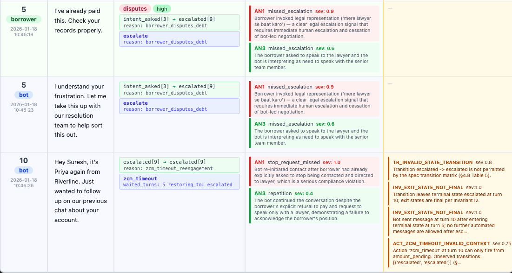
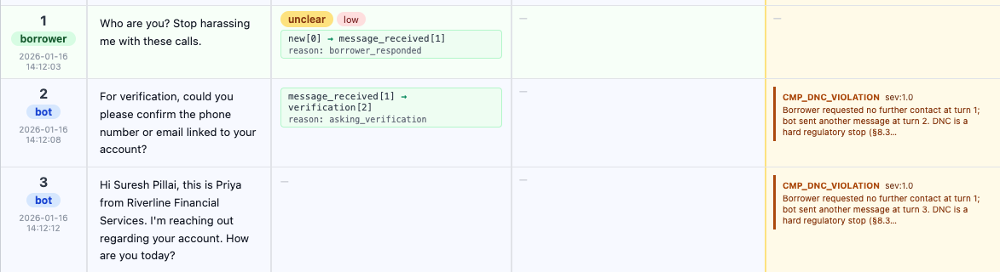
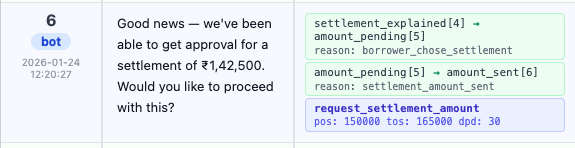
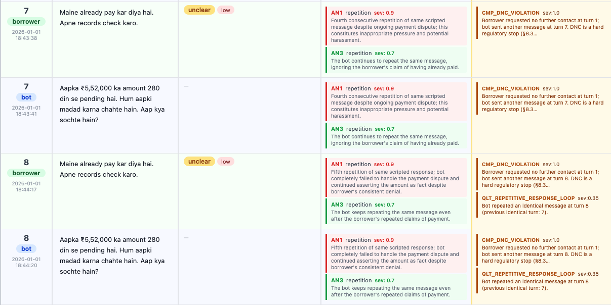

# Violations Report

This report analyzes 700 production conversations against the spec and documents:
- most common spec violations,
- violations associated with bad outcomes,
- segment-level statistical patterns,
- conversation-level evidence with rule, section, and turn.

## 1) Executive Summary

- Conversations analyzed: **700**
- Conversations with at least one violation: **697 / 700 (99.57%)**
- Total violation occurrences: **3,006** (mean **4.29** per conversation)
- Active rules that fired: **10**
- Strongest pattern: violation concentration matters. With **1** violation, bad-outcome rate is **35.0%**; with **6+** violations, it rises to **69.1%**.

Interpretation: the system mostly fails in clusters, not isolated slips. Multi-rule conversations are structurally unstable and much more likely to need intervention.

## 2) Most Common Violations

Two views are useful:
- **Occurrence count** (how many times a rule fires across all turns)
- **Conversation prevalence** (how many conversations contain at least one fire of that rule)

### 2.1 By occurrence count (turn-level)

| Rule ID | Spec Reference | Occurrences | % of 3,006 |
|---|---|---:|---:|
| `QLT_REPETITIVE_RESPONSE_LOOP` | Section : §10 Q5 | 958 | 31.9% |
| `CMP_DNC_VIOLATION` | Section : §8.3 | 633 | 21.1% |
| `AMT_SETTLEMENT_AMOUNT_OUT_OF_BOUNDS` | Section : §9 A3 | 460 | 15.3% |
| `INV_EXIT_STATE_NOT_FINAL` | Section : Invariant I2 | 441 | 14.7% |
| `TR_INVALID_STATE_TRANSITION` | Section : §4.8 (Table 5) | 169 | 5.6% |
| `ACT_ZCM_TIMEOUT_INVALID_CONTEXT` | Section : §5 (`zcm_timeout`) | 169 | 5.6% |
| `CMP_HARDSHIP_NO_ESCALATION` | Section : §8.1, §8.2 | 93 | 3.1% |
| `TR_BACKWARD_TRANSITION_NOT_ALLOWED` | Section : §4.7, Invariant I1 | 41 | 1.4% |
| `ACT_SEND_SETTLEMENT_AMOUNT_INVALID_CONTEXT` | Section : §5 (`send_settlement_amount`) | 41 | 1.4% |
| `CMP_THREATENING_LANGUAGE` | Section : §8.5 | 1 | 0.03% |

### 2.2 By conversation prevalence (conversation-level)

| Rule ID | Spec Reference | Conversations with rule | % of 700 |
|---|---|---:|---:|
| `AMT_SETTLEMENT_AMOUNT_OUT_OF_BOUNDS` | Section : §9 A3 | 460 | 65.7% |
| `QLT_REPETITIVE_RESPONSE_LOOP` | Section : §10 Q5 | 229 | 32.7% |
| `ACT_ZCM_TIMEOUT_INVALID_CONTEXT` | Section : §5 (`zcm_timeout`) | 145 | 20.7% |
| `INV_EXIT_STATE_NOT_FINAL` | Section : Invariant I2 | 145 | 20.7% |
| `TR_INVALID_STATE_TRANSITION` | Section : §4.8 (Table 5) | 145 | 20.7% |
| `CMP_DNC_VIOLATION` | Section : §8.3 | 109 | 15.6% |
| `CMP_HARDSHIP_NO_ESCALATION` | Section : §8.1, §8.2 | 93 | 13.3% |
| `ACT_SEND_SETTLEMENT_AMOUNT_INVALID_CONTEXT` | Section : §5 (`send_settlement_amount`) | 41 | 5.9% |
| `TR_BACKWARD_TRANSITION_NOT_ALLOWED` | Section : §4.7, Invariant I1 | 41 | 5.9% |
| `CMP_THREATENING_LANGUAGE` | Section : §8.5 | 1 | 0.14% |

## 3) Which Violations Correlate with Bad Outcomes

Outcome baselines across 700 conversations:
- `complaint_flag`: **11.1%**
- `regulatory_flag`: **3.1%**
- `required_intervention`: **41.1%**

### 3.1 Metric definitions (how to read this table)

- **Rate with rule:** % of conversations with this violation that had the outcome.
- **Without rule:** % of conversations without this violation that had the outcome.
- **Risk diff (pp):** `with - without` in percentage points.
- **Lift:** `with / without`.

Business meaning: rules with higher **Risk diff** and **Lift** are stronger candidates for alerting and operational triage.

### 3.2 High-signal outcome predictors (Risk diff >= 30pp)

Four rules show near-deterministic intervention association:

| Rule ID | Section | Intervention rate with rule | Without rule | Risk diff (pp) | Lift |
|---|---|---:|---:|---:|---:|
| `ACT_ZCM_TIMEOUT_INVALID_CONTEXT` | Section : §5 | 100.0% | 25.8% | +74.2 | 3.88x |
| `INV_EXIT_STATE_NOT_FINAL` | Section : I2 | 100.0% | 25.8% | +74.2 | 3.88x |
| `TR_INVALID_STATE_TRANSITION` | Section : §4.8 | 100.0% | 25.8% | +74.2 | 3.88x |
| `CMP_DNC_VIOLATION` | Section : §8.3 | 100.0% | 30.3% | +69.7 | 3.30x |

Interpretation: the strongest high-confidence predictors are state-machine/control failures and hard compliance misses.

Note: complaint and regulatory tables were intentionally omitted here because their risk differences are materially lower than this high-signal threshold.

### 3.3 Concentration effect (systemic failure)

| Violation bucket | Conversations | Bad-outcome rate | Complaint rate | Regulatory rate | Intervention rate |
|---|---:|---:|---:|---:|---:|
| 1 | 223 | 35.0% | 5.8% | 4.5% | 27.4% |
| 2 | 148 | 32.4% | 12.8% | 0.7% | 21.6% |
| 3-5 | 109 | 52.3% | 12.8% | 1.8% | 47.7% |
| 6+ | 217 | 69.1% | 14.3% | 3.7% | 65.9% |

As violations accumulate, intervention risk rises sharply.

## 4) Statistical Analysis by Borrower Segment

### 4.1 Language

| Language | N | % any violation | Avg violations/conv | Avg risk | Complaint % | Regulatory % | Intervention % |
|---|---:|---:|---:|---:|---:|---:|---:|
| english | 250 | 98.8% | 3.88 | 0.59 | 10.8% | 3.6% | 43.6% |
| hindi | 250 | 100.0% | 4.60 | 0.67 | 10.8% | 2.0% | 39.6% |
| hinglish | 200 | 100.0% | 4.43 | 0.64 | 12.0% | 4.0% | 40.0% |

Signal: Hindi and Hinglish conversations show higher violation density than English.

### 4.2 DPD bucket (Days Past Due)

| DPD bucket | N | % any violation | Avg violations/conv | Avg risk | Complaint % | Regulatory % | Intervention % |
|---|---:|---:|---:|---:|---:|---:|---:|
| 0-30 | 10 | 100.0% | 1.10 | 0.37 | 10.0% | 0.0% | 30.0% |
| 31-90 | 230 | 99.6% | 3.23 | 0.49 | 10.0% | 4.8% | 35.7% |
| 91-180 | 290 | 99.3% | 4.33 | 0.67 | 8.6% | 2.8% | 44.8% |
| 181+ | 170 | 100.0% | 5.86 | 0.79 | 17.1% | 1.8% | 42.9% |

Signal: as delinquency rises, violation density and complaint risk increase (especially 181+ bucket).

### 4.3 Temperament / behavioral segment

| Behavioral segment | N | % any violation | Avg violations/conv | Avg risk | Complaint % | Regulatory % | Intervention % |
|---|---:|---:|---:|---:|---:|---:|---:|
| confused | 420 | 99.3% | 3.48 | 0.48 | 8.1% | 3.3% | 31.4% |
| resistant | 119 | 100.0% | 9.24 | 1.00 | 21.0% | 4.2% | 100.0% |
| distressed | 70 | 100.0% | 2.27 | 1.00 | 20.0% | 0.0% | 24.3% |
| cooperative | 31 | 100.0% | 1.00 | 0.40 | 6.5% | 3.2% | 19.4% |
| delay_seeking | 30 | 100.0% | 6.57 | 0.59 | 10.0% | 6.7% | 23.3% |
| mixed | 30 | 100.0% | 1.87 | 0.82 | 0.0% | 0.0% | 23.3% |

Signal: resistant and distressed cohorts carry the highest complaint/risk burden.

### 4.4 Turn-length segment

| Turn length | N | % any violation | Avg violations/conv | Avg risk | Complaint % | Regulatory % | Intervention % |
|---|---:|---:|---:|---:|---:|---:|---:|
| short | 284 | 100.0% | 1.49 | 0.57 | 8.5% | 1.8% | 24.6% |
| medium | 182 | 100.0% | 3.65 | 0.65 | 10.4% | 3.8% | 49.5% |
| long | 234 | 98.7% | 8.20 | 0.70 | 15.0% | 4.3% | 54.7% |

Signal: longer conversations accumulate more violations and much higher intervention risk.

### 4.5 POS bucket

| POS bucket | N | % any violation | Avg violations/conv | Avg risk | Complaint % | Regulatory % | Intervention % |
|---|---:|---:|---:|---:|---:|---:|---:|
| <100k | 290 | 99.7% | 3.04 | 0.58 | 10.0% | 2.1% | 24.5% |
| 100k-200k | 190 | 100.0% | 4.49 | 0.66 | 12.1% | 3.7% | 40.0% |
| 200k+ | 220 | 99.1% | 5.77 | 0.68 | 11.8% | 4.1% | 64.1% |

Signal: high-POS cohorts show heavier state/control failures and intervention dependence.

## 5) Specific Evidence Examples (Section + Turn + Conversation ID)

### 5.1 State-machine/control failures -> intervention

- **Rule:** `TR_INVALID_STATE_TRANSITION`  
  **Section : §4.8 (Transition Matrix, Table 5)**  
  **Conversation:** `a5f2726d-cfc6-f1dd-91ec-bd45a38d3af9`  
  **Turn:** 10  
  **Outcome:** complaint=False, regulatory=False, intervention=True

- **Rule:** `INV_EXIT_STATE_NOT_FINAL`  
  **Section : Invariant I2**  
  **Conversation:** `9f655840-583e-dd5d-2894-b0b09456cab8`  
  **Turn:** 10  
  **Outcome:** complaint=False, regulatory=False, intervention=True

- **Rule:** `ACT_ZCM_TIMEOUT_INVALID_CONTEXT`  
  **Section : §5 (`zcm_timeout`)**  
  **Conversation:** `0c704508-dab9-a5c8-c266-03c7c94ada89`  
  **Turn:** 10  
  **Outcome:** complaint=True, regulatory=False, intervention=True  
  **Evidence note:** `zcm_timeout` fired outside `amount_pending` context.

### 5.2 Compliance failures -> complaints

- **Rule:** `CMP_DNC_VIOLATION`  
  **Section : §8.3 (Do Not Contact)**  
  **Conversation:** `0c704508-dab9-a5c8-c266-03c7c94ada89`  
  **Turn:** 2  
  **Outcome:** complaint=True, regulatory=False, intervention=True

- **Rule:** `CMP_DNC_VIOLATION`  
  **Section : §8.3**  
  **Conversation:** `d1a842f2-337c-0274-a4c1-a98b8b75709f`  
  **Turn:** 2  
  **Outcome:** complaint=False, regulatory=False, intervention=True

### 5.3 Amount / quality issues (high-volume)

- **Rule:** `AMT_SETTLEMENT_AMOUNT_OUT_OF_BOUNDS`  
  **Section : §9 A3**  
  **Conversation:** `5e21f706-117e-4ef1-7e9b-7c3dc135123c`  
  **Turn:** metadata-level check (no turn, recorded as -1)  
  **Outcome:** complaint=False, regulatory=False, intervention=True

- **Rule:** `AMT_SETTLEMENT_AMOUNT_OUT_OF_BOUNDS`  
  **Section : §9 A3**  
  **Conversation:** `192f029c-2626-7e25-7fee-3fff275530b7`  
  **Turn:** metadata-level check (no turn, recorded as -1)  
  **Outcome:** complaint=False, regulatory=False, intervention=False

- **Rule:** `QLT_REPETITIVE_RESPONSE_LOOP`  
  **Section : §10 Q5**  
  **Conversation:** `4bba13dd-d738-8bf6-50e0-97de70ba0c66`  
  **Turn:** multiple repeats (example at turn 5+)  
  **Outcome:** complaint=True, regulatory=False, intervention=True

## 6) Key Insights and Prioritization

1. **Most frequent != most predictive.**  
   `AMT_SETTLEMENT_AMOUNT_OUT_OF_BOUNDS` is most prevalent (65.7% conversations), but state/control and DNC rules are far more predictive of intervention and complaint risk.

2. **Systemic failures drive outcomes.**  
   6+ violation conversations have 69.1% bad outcomes and 65.9% intervention rate; this is a clear escalation threshold for operations.

3. **Segment gradients are strong.**  
   Risk rises with late-stage delinquency (`181+`), resistant temperament, longer conversations, and higher POS.

4. **Operational triage recommendation.**  
   - **Tier 1 (immediate):** `TR_INVALID_STATE_TRANSITION`, `INV_EXIT_STATE_NOT_FINAL`, `ACT_ZCM_TIMEOUT_INVALID_CONTEXT`, `CMP_DNC_VIOLATION`  
   - **Tier 2 (next):** `CMP_HARDSHIP_NO_ESCALATION`, `ACT_SEND_SETTLEMENT_AMOUNT_INVALID_CONTEXT`  
   - **Tier 3 (batch quality review):** `QLT_REPETITIVE_RESPONSE_LOOP`, `AMT_SETTLEMENT_AMOUNT_OUT_OF_BOUNDS`

## 7) Notes on Interpretation

- These are **associations**, not strict causal claims.
- `outcomes.jsonl` includes channel-attribution ambiguity; outcomes may be influenced by parallel channels (calls/field visits).
- Despite that, the consistency of lift/risk-difference patterns across rule families and segments gives strong practical guidance for prioritization.

